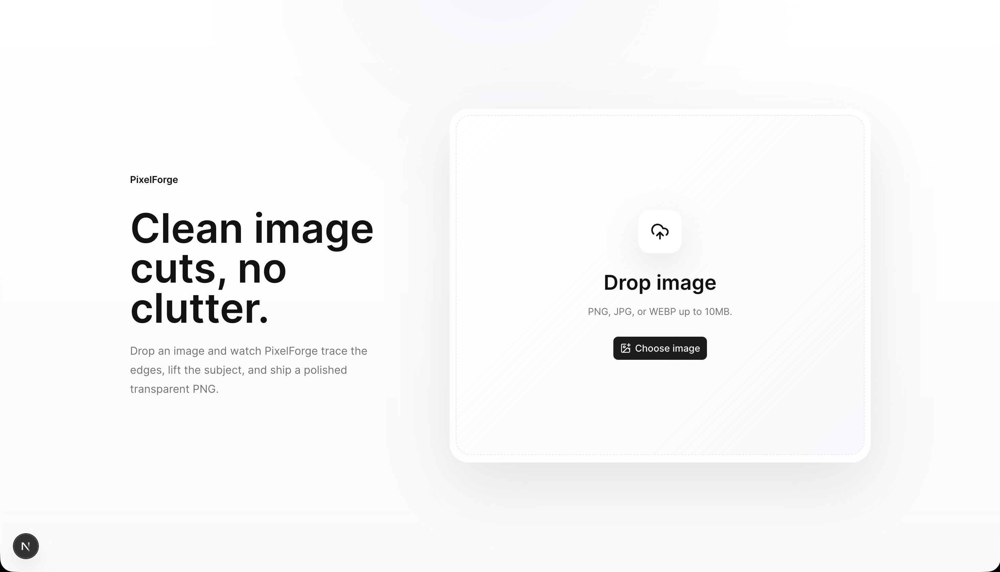
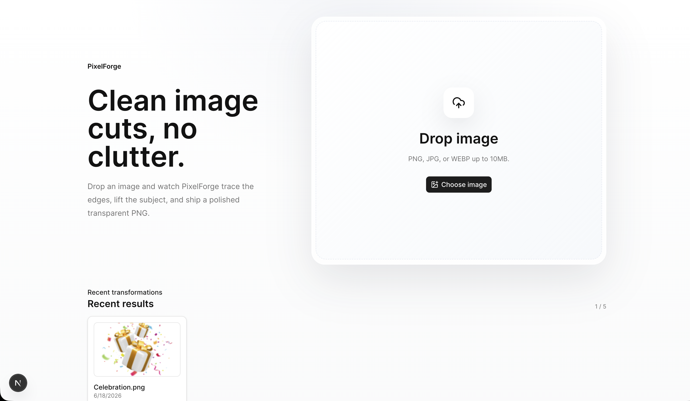
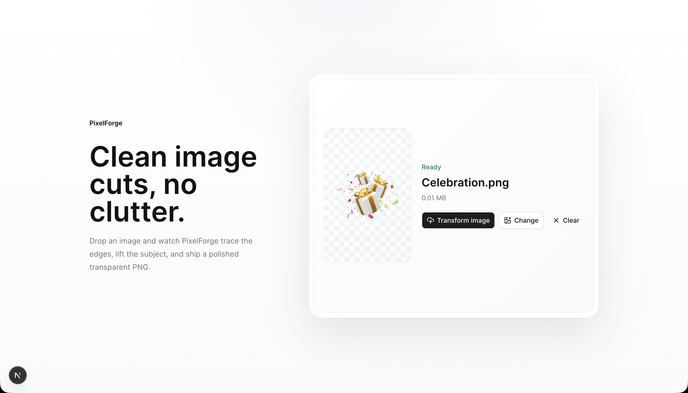
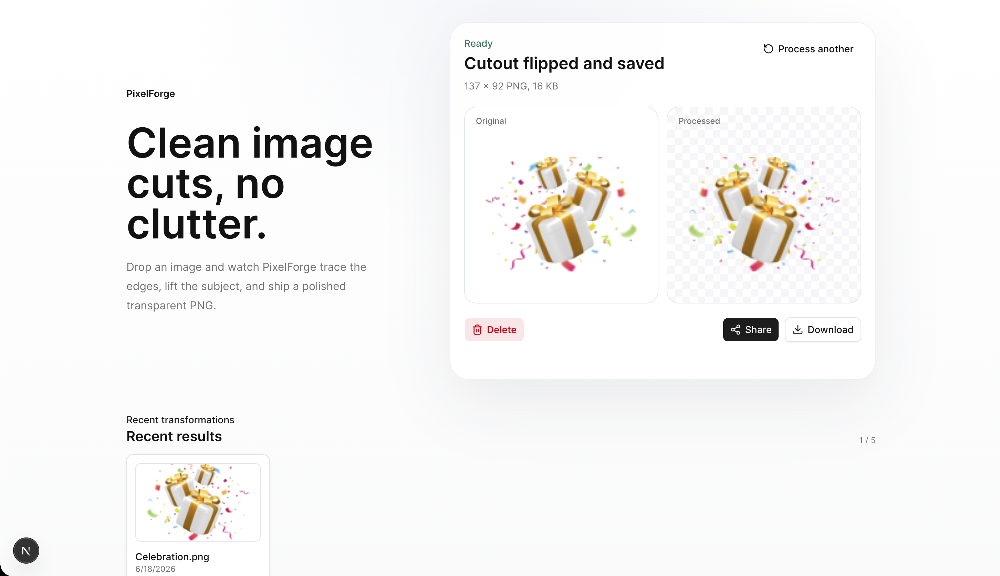

# PixelForge

PixelForge is a full-stack image transformation web app built with Next.js. Drop an image, and PixelForge automatically removes the background using the Clipdrop AI API, flips it horizontally, and delivers a polished transparent PNG all in a single click. Processed images are stored on Vercel Blob and can be downloaded, shared, or deleted directly from the UI.

---

## 🔗 Live Demo

**Try it live:** [https://www.heyashish.dev/pixelforge](https://www.heyashish.dev/pixelforge)

## Preview

| Landing                                    | Upload                                        |
| ------------------------------------------ | --------------------------------------------- |
|  |  |

| Ready to process                                                            | Processed result                                |
| --------------------------------------------------------------------------- | ----------------------------------------------- |
|  |  |

---

## Table of Contents

- [Screenshots](#screenshots)
- [Features](#features)
- [Tech Stack](#tech-stack)
- [Project Structure](#project-structure)
- [Components](#components)
- [API Routes](#api-routes)
- [Hooks](#hooks)
- [Lib / Utilities](#lib--utilities)
- [Types](#types)
- [Environment Variables](#environment-variables)
- [Getting Started](#getting-started)
- [Build & Deployment](#build--deployment)
- [Development Notes](#development-notes)
- [Error Handling](#error-handling)

---

## Features

- **Drag-and-drop upload** Drop an image onto the dropzone or click to open the file browser
- **Background removal** Powered by the [Clipdrop API](https://clipdrop.co/apis/docs/remove-background); falls back to pass-through in local development
- **Horizontal flip** Applied to the cutout via [Jimp](https://github.com/jimp-dev/jimp) after background removal
- **Transparent PNG output** Result is always a clean `image/png`
- **Cloud storage** Processed images are uploaded to [Vercel Blob](https://vercel.com/docs/storage/vercel-blob) with public access URLs
- **Animated processing view** Multi-stage progress bar with Framer Motion animations (respects `prefers-reduced-motion`)
- **Side-by-side comparison** Original vs. processed image shown after completion
- **Download** One-click PNG download using Blob API with fallback to new tab
- **Share / Copy** Native Web Share API on mobile; clipboard fallback on desktop
- **Delete** Removes image from both the UI and Vercel Blob storage; uses optimistic UI with rollback on failure
- **Processing history** Up to 5 recent results persisted in `localStorage` via `useSyncExternalStore`; items can be re-opened or deleted
- **Client-side validation** File type, size, and emptiness checked before upload
- **Toast notifications** Success and error feedback via [Sonner](https://sonner.emilkowal.ski/)
- **Fully typed** TypeScript throughout, including API response shapes and error codes

---

## Tech Stack

| Layer                | Technology              |
| -------------------- | ----------------------- |
| Framework            | Next.js 16 (App Router) |
| UI library           | React 19                |
| Styling              | Tailwind CSS 4          |
| Animation            | Framer Motion 12        |
| Background removal   | Clipdrop API            |
| Image processing     | Jimp 1                  |
| Storage              | Vercel Blob             |
| Validation           | Zod 4                   |
| Component primitives | Radix UI + shadcn/ui    |
| Icons                | Lucide React            |
| Toasts               | Sonner                  |
| Language             | TypeScript 5            |

---

## Project Structure

```
src/
├── app/
│   ├── api/
│   │   ├── process/route.ts   # POST upload, remove bg, flip, store
│   │   └── delete/route.ts    # DELETE remove image from Vercel Blob
│   ├── icon.tsx               # Generated app icon
│   ├── layout.tsx             # Root layout, metadata, Toaster
│   ├── not-found.tsx          # 404 page
│   └── page.tsx               # Entry point → renders <PixelForgeApp />
│
├── components/
│   ├── PixelForgeApp.tsx      # Root app component (state, orchestration)
│   ├── UploadDropzone.tsx     # Drag-and-drop file picker
│   ├── ProcessingView.tsx     # Animated progress/stage display
│   ├── ImageComparison.tsx    # Before/after result view
│   ├── ResultActions.tsx      # Download, share/copy, delete buttons
│   ├── HistoryList.tsx        # Recent results grid (localStorage)
│   ├── DeleteConfirmDialog.tsx # Confirmation modal for deletion
│   └── ui/
│       └── button.tsx         # shadcn/ui button component
│
├── hooks/
│   ├── useImageProcessor.ts   # Manages API call, stage, progress, result
│   ├── useLocalHistory.ts     # localStorage history via useSyncExternalStore
│   └── useReducedMotionSafe.ts # SSR-safe prefers-reduced-motion hook
│
├── lib/
│   ├── constants.ts           # File limits, accepted types, history size
│   ├── errors.ts              # AppError class, error codes, Clipdrop error map
│   ├── imageProcessor.ts      # Calls Clipdrop API + Jimp flip
│   ├── schemas.ts             # Zod schemas for upload and delete validation
│   ├── storage.ts             # Vercel Blob upload/delete wrappers
│   └── utils.ts               # cn() utility (clsx + tailwind-merge)
│
└── types/
    └── index.ts               # ProcessingStage, ProcessResult, HistoryItem, etc.
```

---

## Components

### `PixelForgeApp`

The root client component. Owns all top-level state and wires the child components together.

**State managed:**

- `selectedFile` / `previewUrl` the file chosen by the user
- `clientError` validation error shown before upload
- `deleteTarget` tracks which item is pending deletion (`"result"` or `"history"`)

**Key responsibilities:**

- Validates file client-side via `validateClientFile` before accepting selection
- Calls `processFile` from `useImageProcessor` on submit
- Adds result to history after successful processing
- Implements **optimistic delete** removes item from UI immediately, makes DELETE API call, rolls back with `toast.error` on failure
- Passes memoized props to all child components to prevent unnecessary re-renders

---

### `UploadDropzone`

Drag-and-drop file picker using [react-dropzone](https://react-dropzone.js.org/).

- Accepts `image/jpeg`, `image/png`, `image/webp` (up to configured `MAX_UPLOAD_SIZE_MB`)
- Shows a checkerboard preview once a file is selected
- Displays file name and size in MB
- Three action buttons: **Transform image**, **Change**, **Clear**
- Validates files inline via `validateClientFile` as a custom dropzone validator

---

### `ProcessingView`

Animated panel shown during and after processing.

**Stages displayed (with status copy):**

| Stage         | Message                       |
| ------------- | ----------------------------- |
| `idle`        | Waiting for an image...       |
| `selected`    | Ready to transform.           |
| `uploading`   | Uploading your image...       |
| `analyzing`   | Detecting the main subject... |
| `removing-bg` | Isolating the subject...      |
| `flipping`    | Applying horizontal flip...   |
| `finalizing`  | Finalizing your cutout...     |
| `complete`    | Your PixelForge is ready.     |
| `error`       | Processing stopped.           |

**Animations (Framer Motion):**

- Image pulses with scale and saturation during processing
- 3D `rotateY` flip animation during the `flipping` stage
- Scanning light sweep across the image during `analyzing`, `removing-bg`, `finalizing`
- Pulsing cyan border glow during tracing stages
- Animated corner marks
- All animations are disabled when `prefers-reduced-motion` is set

---

### `ImageComparison`

Side-by-side before/after view shown on completion.

- Displays original preview (from `ObjectURL`) on the left
- Processed transparent PNG on a checkerboard background on the right
- Shows output dimensions and file size (in KB)
- Includes `ResultActions` for download/share/delete
- **Process another** button to start over

---

### `ResultActions`

Action bar for the completed result.

- **Share** Uses Web Share API if available (mobile); falls back to clipboard copy
- **Download** Fetches the blob and triggers a file download as `pixelforge-<name>.png`; fallback opens the URL in a new tab
- **Delete** Triggers the delete confirmation dialog

Uses `useRef` + `forceRender` pattern for transient states (copying, downloading) to avoid triggering full component re-renders during async operations.

---

### `HistoryList`

Grid of up to 5 recent processed images, persisted in `localStorage`.

- Each card shows a thumbnail, original file name, creation date
- **Copy URL** button with 1.6s visual feedback
- **Delete** button opens the confirmation dialog
- **View all** / **Show less** toggle if items exceed `maxVisible`
- Individual cards are memoized (`HistoryCard`) to prevent re-renders when only one card's state changes

---

### `DeleteConfirmDialog`

Modal confirmation dialog for destructive delete actions.

- Shows item name in the title
- Cancel / Delete buttons
- Rendered conditionally (returns `null` when `open` is `false`)
- Accessible: `role="dialog"`, `aria-modal`, `aria-labelledby`

---

## API Routes

### `POST /api/process`

Processes an uploaded image: removes background, flips horizontally, stores on Vercel Blob.

**Request:** `multipart/form-data` with a `file` field.

**Response (200):**

```json
{
  "id": "uuid",
  "processedUrl": "https://...",
  "pathname": "processed/<uuid>.png",
  "originalName": "photo.jpg",
  "size": 123456,
  "width": 800,
  "height": 600,
  "createdAt": "2024-01-01T00:00:00.000Z"
}
```

**Errors:** `400` invalid/missing file, `402` quota exhausted, `422` no subject detected, `429` rate limited, `502` Clipdrop unavailable, `504` timeout.

---

### `DELETE /api/delete`

Deletes a processed image from Vercel Blob storage.

**Request body:**

```json
{ "pathname": "processed/<uuid>.png" }
```

Path is validated with Zod must start with `processed/`.

**Response (200):**

```json
{ "success": true, "message": "Image deleted successfully." }
```

---

## Hooks

### `useImageProcessor`

Manages the full lifecycle of an image processing request.

- Tracks `stage` (one of the `ProcessingStage` union values)
- Tracks `progress` (0–100) with simulated intermediate steps to give visual feedback while waiting for the API
- Cancels in-flight requests via `AbortController` when `reset()` or a new `processFile()` is called
- Detects offline state and provides a user-friendly error message
- Exposes `setResult` and `setStage` for the parent to rehydrate state from history

**Simulated stage timing:**

| Stage       | Progress | Delay  |
| ----------- | -------- | ------ |
| uploading   | 12%      | 120ms  |
| analyzing   | 32%      | 650ms  |
| removing-bg | 62%      | 1200ms |
| flipping    | 84%      | 1700ms |
| finalizing  | 96%      | 2200ms |

---

### `useLocalHistory`

Persists and reads the processing history from `localStorage`.

- Uses `useSyncExternalStore` for React 18+ concurrent-safe access
- Listens to both the native `storage` event (cross-tab sync) and a custom `pixelforge-history-change` event (same-tab sync)
- Caches the last parsed value to keep a stable object reference between renders
- Caps history at `MAX_HISTORY_ITEMS` (5) oldest entries are dropped when the limit is reached
- Gracefully handles `localStorage` being unavailable (e.g. private browsing)

---

### `useReducedMotionSafe`

SSR-safe wrapper around `window.matchMedia("(prefers-reduced-motion: reduce)")`.

Returns `false` on the server (no `window`), and the live media query result on the client. Used in `ProcessingView` to conditionally render all animations.

---

## Lib / Utilities

### `lib/imageProcessor.ts`

Core image processing logic.

1. **Background removal** POSTs to `https://clipdrop-api.co/remove-background/v1` with a 30-second `AbortController` timeout. In `NODE_ENV=development`, this step is skipped and the original buffer is passed through.
2. **Horizontal flip** Reads the result with Jimp and calls `image.flip({ horizontal: true })`.
3. Returns a `ProcessedBuffer` with `{ buffer, width, height }`.

---

### `lib/storage.ts`

Vercel Blob wrappers.

- `uploadProcessedImage(buffer, pathname)` Uploads to `processed/<uuid>.png` with `access: "public"`. In `NODE_ENV=development`, returns a `data:` URI instead.
- `deleteProcessedImage(pathname)` Calls `del(pathname)`. No-ops in development.

---

### `lib/errors.ts`

Centralised error system.

- `AppError` extends `Error` with a typed `code` (from `ERROR_CODES`) and HTTP `status`
- `errorResponse(error)` converts any thrown value to a structured JSON `Response`
- `mapClipdropStatus(status)` maps Clipdrop HTTP status codes to `AppError` instances with user-friendly messages
- All error messages are defined in `ERROR_MESSAGES` keyed by `ErrorCode`

---

### `lib/schemas.ts`

Zod-based validation.

- `DeleteSchema` validates the delete request body (`pathname` must start with `processed/`)
- `validateUploadFile(file)` throws `AppError` if file is missing, empty, too large, or wrong type
- `validateClientFile(file)` same validation, returns an error string instead of throwing (used client-side)

---

### `lib/constants.ts`

```ts
ACCEPTED_IMAGE_TYPES; // ['image/jpeg', 'image/png', 'image/webp']
ACCEPTED_EXTENSIONS; // { 'image/jpeg': ['.jpg', '.jpeg'], ... }
MAX_UPLOAD_SIZE_MB; // from env, default 10
MAX_FILE_SIZE; // MAX_UPLOAD_SIZE_MB * 1024 * 1024
MAX_HISTORY_ITEMS; // 5
HISTORY_STORAGE_KEY; // 'pixelforge-history'
MAX_IMAGE_DIMENSION; // 4000
```

---

### `lib/utils.ts`

Exports `cn(...inputs)` combines `clsx` and `tailwind-merge` for conditional class composition.

---

## Types

Defined in `src/types/index.ts`:

```ts
type ProcessingStage =
  | "idle"
  | "selected"
  | "uploading"
  | "analyzing"
  | "removing-bg"
  | "flipping"
  | "finalizing"
  | "complete"
  | "error";

interface ProcessResult {
  id: string;
  processedUrl: string;
  pathname: string;
  originalName: string;
  size: number;
  width?: number;
  height?: number;
  createdAt: string;
}

interface HistoryItem extends ProcessResult {
  originalPreview?: string; // ObjectURL of original, stored in memory only
}

interface ApiErrorResponse {
  error: string;
  code: string;
  message: string;
}
```

---

## Environment Variables

Create a `.env` file in the project root:

```bash
# Required in production Clipdrop background removal API key
# Get one at https://clipdrop.co/apis
CLIPDROP_API_KEY=

# Required in production Vercel Blob read/write token
# Provided automatically on Vercel; create one in your Vercel project settings
BLOB_READ_WRITE_TOKEN=

# Optional maximum upload size in MB (default: 10)
MAX_UPLOAD_SIZE_MB=10
```

> **Development note:** In `NODE_ENV=development`, both `CLIPDROP_API_KEY` and `BLOB_READ_WRITE_TOKEN` are optional. Background removal is skipped (original image is passed through) and processed images are returned as inline `data:` URIs instead of being uploaded to Blob.

---

## Getting Started

**Prerequisites:** Node.js 18+, npm

```bash
# 1. Install dependencies
npm install

# 2. Create environment file
cp .env.example .env   # or create .env manually (see above)

# 3. Start the development server
npm run dev
```

Open [http://localhost:3000](http://localhost:3000).

In development mode, API keys are not required images are processed locally (no background removal) and stored as base64 data URIs.

---

## Build & Deployment

```bash
# Type-check + build
npm run build

# Start production server
npm run start

# Lint
npm run lint
```

**Deploying to Vercel:**

1. Push the repo to GitHub/GitLab
2. Import the project in [Vercel](https://vercel.com)
3. Add the three environment variables in **Project Settings → Environment Variables**
4. Deploy Vercel automatically provisions a Blob store if `BLOB_READ_WRITE_TOKEN` is configured

---

## Development Notes

### Performance patterns

The codebase applies several React performance techniques throughout:

- All components that receive props are wrapped in `React.memo` for shallow prop comparison
- All callbacks are wrapped in `useCallback` with correct dependency arrays to provide stable references to memoized children
- Derived values are wrapped in `useMemo`
- Transient UI states (copy feedback, download spinner) use `useRef` + a `forceRender({})` pattern to avoid triggering full re-renders
- `useSyncExternalStore` is used for `localStorage` history to be concurrent-mode safe
- Object URLs (`URL.createObjectURL`) are revoked in cleanup effects to prevent memory leaks
- `AbortController` is used to cancel in-flight fetch requests when components unmount or a new request starts

### Local development fallbacks

| Feature            | Production          | Development              |
| ------------------ | ------------------- | ------------------------ |
| Background removal | Clipdrop API        | Pass-through (no change) |
| Image storage      | Vercel Blob URL     | Base64 `data:` URI       |
| Delete             | Vercel Blob `del()` | No-op                    |
